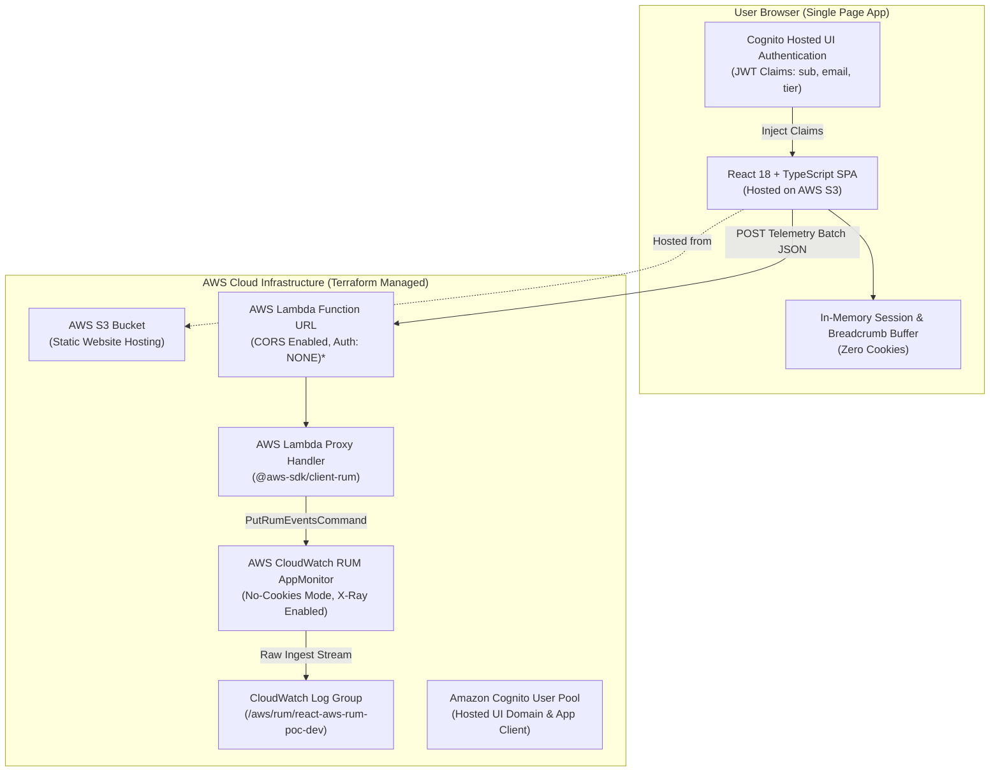

# React AWS CloudWatch RUM & Lambda Proxy Prototype

A complete serverless proof-of-concept (POC) demonstrating **Frontend Telemetry, Error Monitoring, Core Web Vitals, and HTTP Request Tracking** using **AWS CloudWatch RUM (Real User Monitoring)** in **No-Cookies Mode**, combined with an **AWS Lambda Telemetry Backend Proxy** and **Amazon Cognito User Pool Hosted UI** for user claims-linking.

The entire infrastructure and deployment lifecycle is automated via **Terraform** and deployed to an **AWS S3 Static Website Hosting** bucket.

---

## 🎯 Project Intent & Mission

1. **No-Cookies Telemetry**: Demonstrates how to run frontend monitoring without relying on persistent client cookies or third-party tracking scripts, ensuring full privacy compliance (GDPR/ePrivacy).
2. **Zero Client AWS Credentials**: Eliminates the need for unauthenticated Cognito Identity Pool guest roles in the browser by routing telemetry through an authorized AWS Lambda backend proxy.
3. **Authenticated Claims Linking**: Directly extracts JWT claims (`email`, `sub`, `tier`) from Cognito User Pool tokens and links them to every RUM event and error payload.
4. **Rich Lead-Up Breadcrumb Buffering**: Maintains an in-memory rolling buffer of user interactions (button clicks, navigation route changes, network calls) attached to error diagnostic reports upon unexpected crashes.
5. **Real-time Ingestion to CloudWatch**: Ensures RUM telemetry (Errors, Page Views, Custom Events, HTTP Statuses) is validated with required schema metadata and pushed into CloudWatch Log Group `/aws/rum/<appMonitorName>`.

---

## 🏗️ Architecture Design



> [!IMPORTANT]
> **Prototype POC vs. Production Architecture**:
> In this prototype POC, the Lambda backend proxy is invoked directly via an **AWS Lambda Function URL** (with CORS enabled and Auth NONE) to keep the infrastructure lightweight, serverless, and easy to deploy without additional billing overhead.
>
> In a **Production Deployment**, the Lambda function should sit behind an **Application Load Balancer (ALB)** or **Amazon API Gateway** with:
> - AWS WAF (Web Application Firewall) rate-limiting & bot protection
> - CSRF token verification & API authentication
> - Managed caching and DDoS shielding

---

## 📁 Repository Structure

```text
react-aws-logging/
├── frontend/                     # React + Vite + TypeScript frontend
│   ├── src/
│   │   ├── App.tsx               # Main interactive Telemetry Lab UI & Claims Inspector
│   │   ├── rum.ts                # In-memory RUM client, breadcrumbs, & Lambda proxy forwarder
│   │   ├── main.tsx              # Application entrypoint
│   │   └── index.css             # Tailwind CSS styling
│   ├── package.json
│   └── vite.config.ts
├── lambda/                       # AWS Lambda Telemetry Backend Proxy
│   └── index.mjs                 # PutRumEvents forwarder with metadata enrichment
├── terraform/                    # Infrastructure as Code (IaC)
│   ├── main.tf                   # S3, Lambda, RUM AppMonitor, Cognito User Pool, IAM
│   ├── variables.tf              # Region and environment configuration
│   └── outputs.tf                # Exported endpoints and resource IDs
├── scripts/
│   ├── deploy.ps1                # Automated 1-Click Terraform + Build + S3 Sync script
│   └── destroy.ps1               # Automated resource teardown script
├── package.json                  # Root package scripts
└── README.md
```

---

## 🚀 Quick Start & 1-Click Deployment

### Prerequisites
1. **AWS CLI** installed and configured (`aws sts get-caller-identity`).
2. **Terraform** v1.0+ installed (`terraform version`).
3. **Node.js** v18+ and **npm** installed (`node -v`).

### Deploying
Run the automated deployment script from the project root:
```powershell
npm run deploy
```
*Or directly with PowerShell:*
```powershell
powershell -ExecutionPolicy Bypass -File scripts/deploy.ps1
```

The script will:
1. Initialize and apply Terraform to provision S3, Lambda, RUM AppMonitor, and Cognito User Pool.
2. Export the live AWS endpoints directly into `frontend/.env.production`.
3. Compile the React TypeScript Vite app bundle.
4. Synchronize build artifacts to the public S3 static website hosting bucket.
5. Display the live Website URL and CloudWatch Log Group.

---

## 🔬 Testing Telemetry in Action

Open the live S3 website URL in your browser:

1. **User Authentication & Claims Linking**:
   - Click **Login via Cognito Hosted UI** to authenticate with the pre-seeded demo account (`testuser@example.com` / `P@ssword123!`) or register a new user.
   - On redirect, the app decodes JWT tokens and binds your user identity (`email`, `sub`, `tier`) to all subsequent events.
2. **User-Attributed Errors**:
   - Click **Trigger Uncaught TypeError** or **Trigger Unhandled Promise Rejection**.
   - Inspect the in-app debug stream and verify in CloudWatch RUM that the error is attributed to the logged-in user.
3. **HTTP / API Telemetry**:
   - Click **200 OK**, **404 Not Found**, **500 Error**, or **2s Latency**.
   - Telemetry is formatted as `com.amazon.rum.http_event` and forwarded to CloudWatch RUM.
4. **Lead-up Breadcrumbs**:
   - Navigate through tabs and perform actions to generate rolling breadcrumbs.
   - When an error occurs, the breadcrumb trail is automatically attached to the error payload.

---

## 📊 Viewing Logs in AWS CloudWatch

1. Open the **AWS Management Console** in your configured region (`ap-southeast-1` by default).
2. **CloudWatch RUM Console**:
   - Navigate to **CloudWatch** > **Application Signals** > **Real-User Monitoring (RUM)**.
   - Open AppMonitor `react-aws-rum-poc-dev`.
   - View tabs: **Overview**, **Errors**, **HTTP Requests**, and **User Journey**.
3. **CloudWatch Log Insights**:
   - Go to **CloudWatch** > **Logs Insights**.
   - Select log group `/aws/rum/react-aws-rum-poc-dev`.
   - Run queries against incoming JSON telemetry events:
     ```sql
     fields @timestamp, event_type, event_details.response.status, event_details.request.url
     | filter event_type = "com.amazon.rum.http_event"
     | sort @timestamp desc
     ```

---

## 🧹 Teardown / Cleanup

To delete all provisioned AWS resources and prevent recurring charges:
```powershell
npm run destroy
```
*Or directly via PowerShell:*
```powershell
powershell -ExecutionPolicy Bypass -File scripts/destroy.ps1
```

---

## 📄 License
MIT
